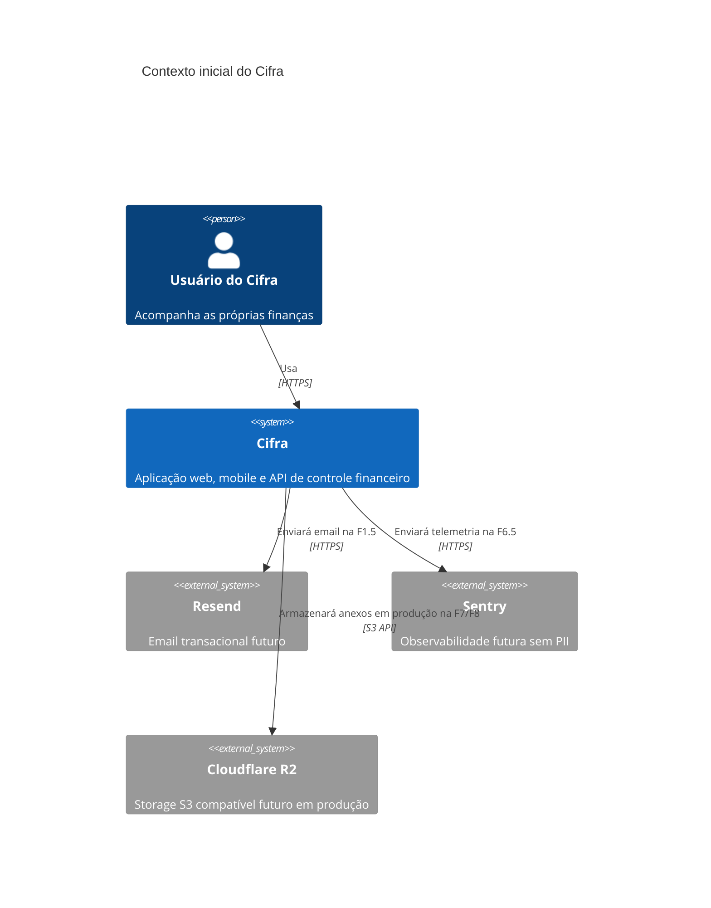

# C4 — Contexto do Cifra

## Escopo

O Cifra permite que uma pessoa acompanhe sua vida financeira de forma confiável pela web e por Android. Nesta F0, apenas a fundação técnica e os checks de saúde existem.

## Pessoas e sistemas

## Contêineres da fundação

| Contêiner | Responsabilidade atual | Tecnologia |
|---|---|---|
| Web | Página inicial e consumo tipado do health da API | Next.js, TypeScript, Tailwind |
| Mobile | Tela inicial e cliente da API preparado | Expo, Expo Router, TypeScript |
| API | Liveness e readiness real das dependências | FastAPI, Python |
| PostgreSQL | Persistência relacional futura | PostgreSQL 16 |
| Redis | Cache e coordenação futura | Redis 7 |
| Storage local | Storage S3 compatível em desenvolvimento | MinIO |

## Relações atuais

- Usuário acessa a web pelo navegador ou o mobile Android.
- Web e mobile dependem de `packages/api-client`; nenhum deles usa chamadas HTTP cruas dentro da aplicação.
- API verifica PostgreSQL, Redis e MinIO antes de declarar readiness.
- MinIO representa localmente o contrato S3 compatível que será atendido pelo Cloudflare R2 em produção.

## Fora do escopo da F0

Autenticação, modelos financeiros, importação CSV, jobs, anexos, observabilidade externa, email, deploy e integrações bancárias não são implementados nesta fundação. Resend, Sentry, Cloudflare R2 e Open Finance são contextos futuros, não dependências em execução na F0.
